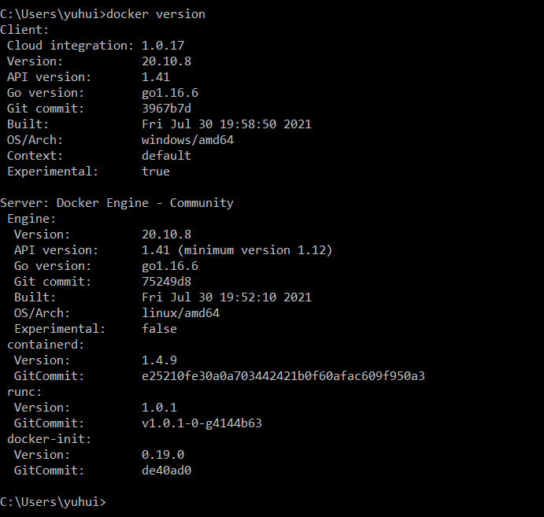
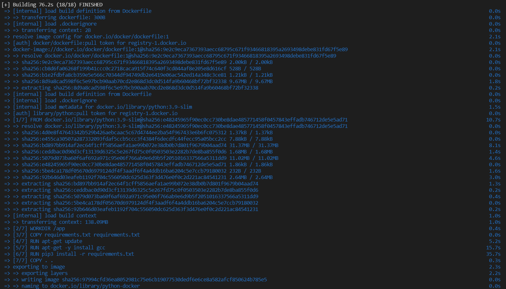
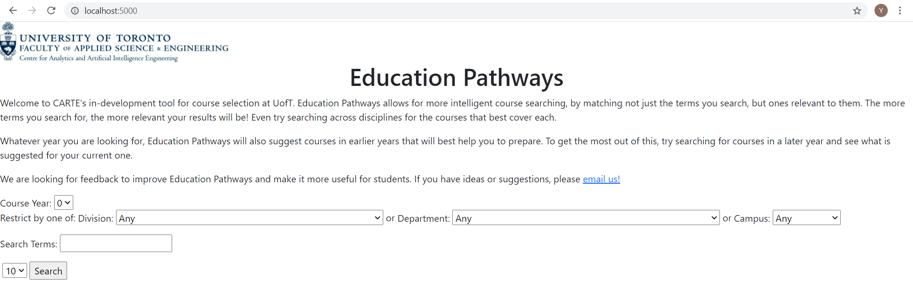

# ECE444-F2021-Lab3
Yuhui Jiang

# Activity1

# Activity2
This repo is a clone of https://github.com/nelaturuk/education_pathways.

# Activity3

# Activity4

# Activity5
Functional Requirement:
System requirement. For now, the system doesn't show any error messages to the user when the search fails and instead it just show a table with 0 entries. So the user don't know if the search fails because there is no matched result or some backend server errors happened. I'd like to make improvements by adding error messages to the response of the system and also provide suggestions to the user to increase search accuracy. 

Non-Functional Requirement:
Usability. When I was playing with the application, I found there is no demonstration/examples explaining how to make some general search. Hence it's may be hard for some begginer users to know how to fill in the search form and interact with the system. I'd like to improve the usability by adding some text instructions or video demonstration links in the UI to better guide the users to make the search. 